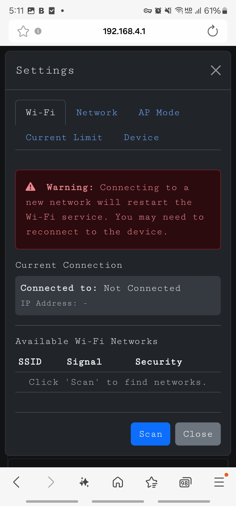
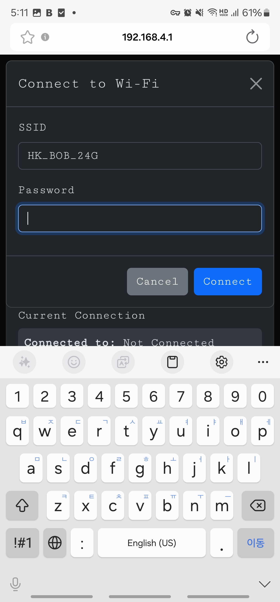
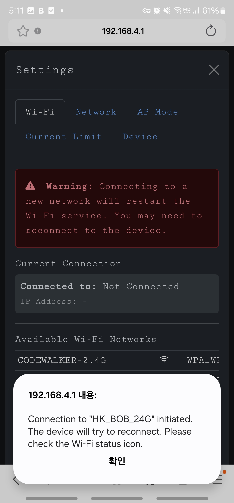
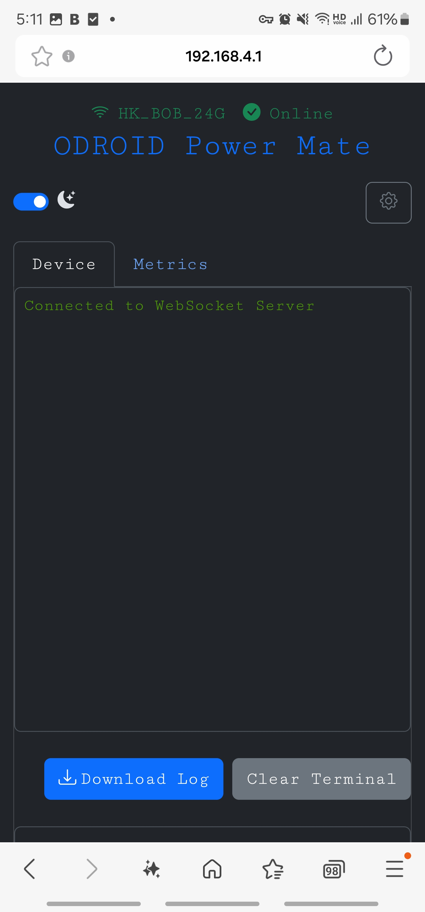
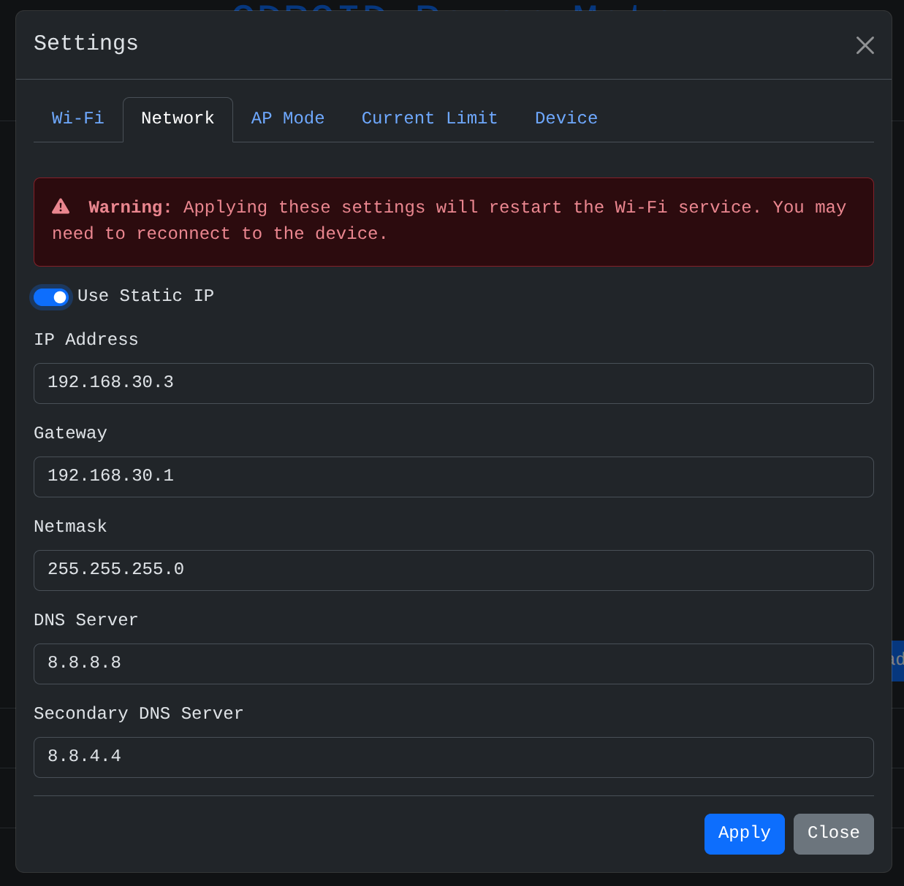
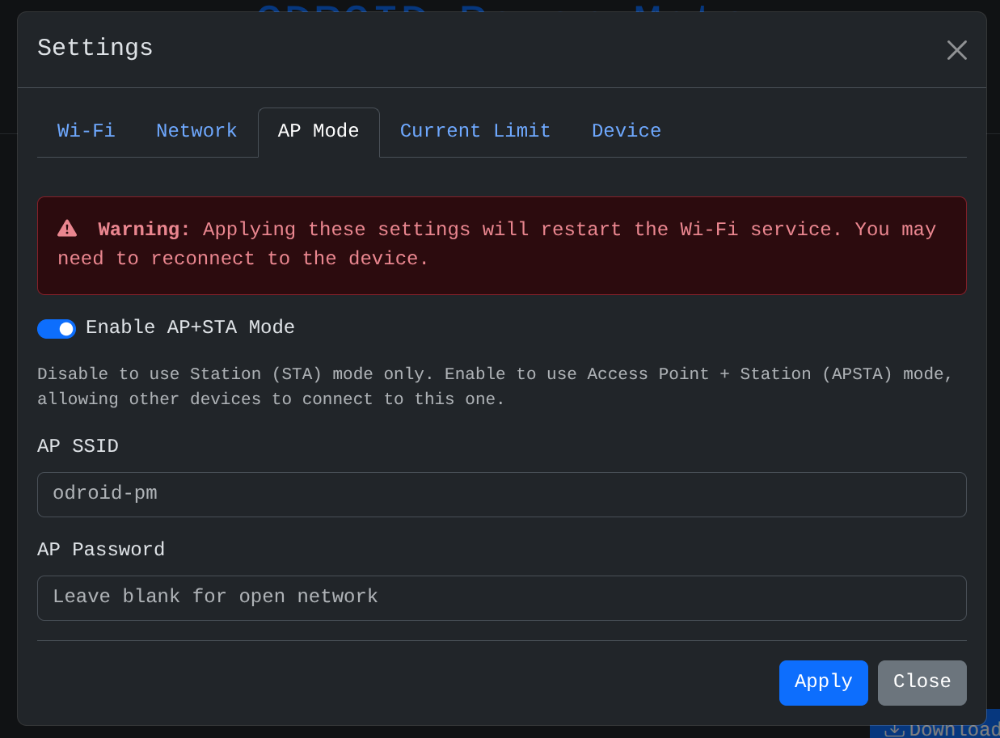
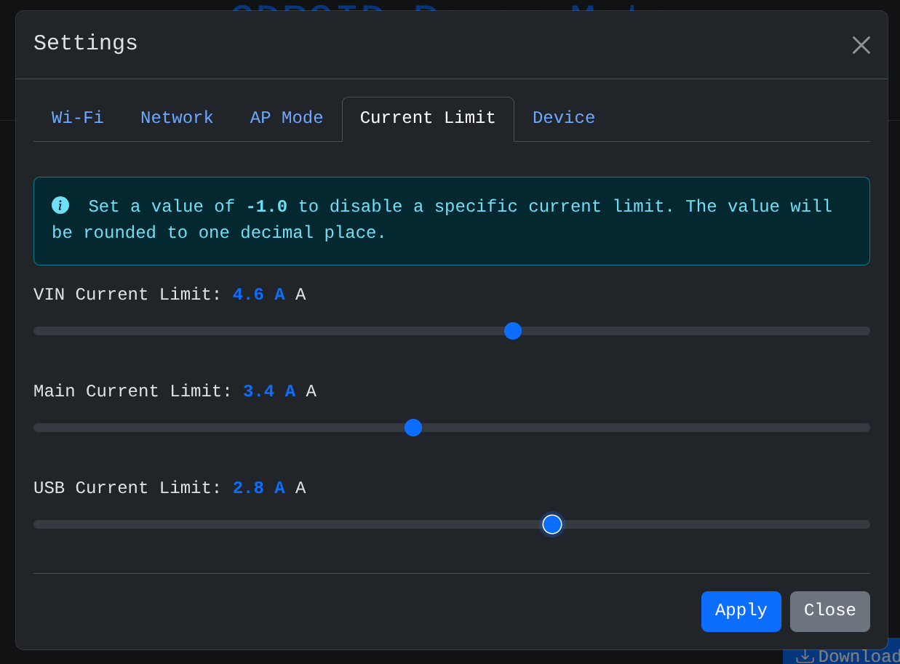
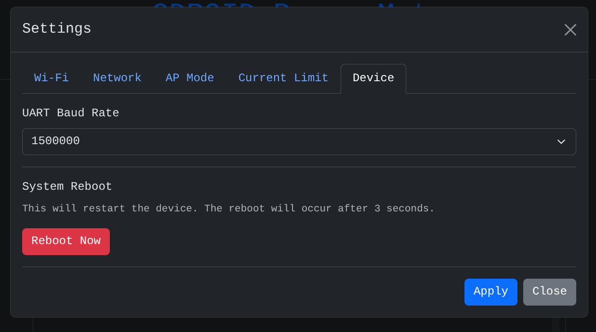

# Settings

> **Warning**
> Wi-Fi and IP related settings will restart the Wi-Fi service.
> After applying the settings, you may need to reconnect to the page.
>
> Please be careful when applying settings. Incorrect settings may prevent you from connecting to the device.
> If you have problems with the device settings, connect the debug USB-C connector to check the device's logs.
> If necessary, you can re-update the firmware to initialize the device.

## Connect to Wi-Fi

The device boots in APSTA mode by default and services the following AP.

- SSID: odroid-pm
- Password: powermate

After connecting to the above AP using a smartphone, etc., you can configure the device by accessing the
`http://192.168.4.1` address.

> **Warning**
> A warning that the AP does not have internet may appear. Please press `Allow connection` to connect to the device.

You can open the settings window by pressing the gear button at the top.
Press the Scan button to see a list of nearby APs.

After entering the password, press the Connect button and PowerMate will attempt to connect to the AP.
For public APs, leave the Password blank.

When Wi-Fi is connected, the green SSID name appears at the top of the page.

## Set static ip

You can assign the IP of the device yourself.
You can set the IP directly by turning on the `Use Static IP` toggle in the `Network` tab.

## AP Mode

Configure the AP function of PowerMate.

If you do not need the AP service, it is recommended to disable it.

## Current Limit

Monitors the current of PowerMate, and if a value higher than the set current is detected, all load switches are turned
off.

## Device

Sets the UART Baudrate. Please match it with the baudrate of the connected ODROID.

| ODROID           | Baud rate                  |
|------------------|----------------------------|
| ODROID-C4        | 115200                     |
| ODROID-C5        | 921600                     |
| ODROID-M1/M1S/M2 | 1500000                    |
| ODROID-H3/4      | According to user settings |

You can reboot the PowerMate. The state of the load switch does not change due to rebooting.

