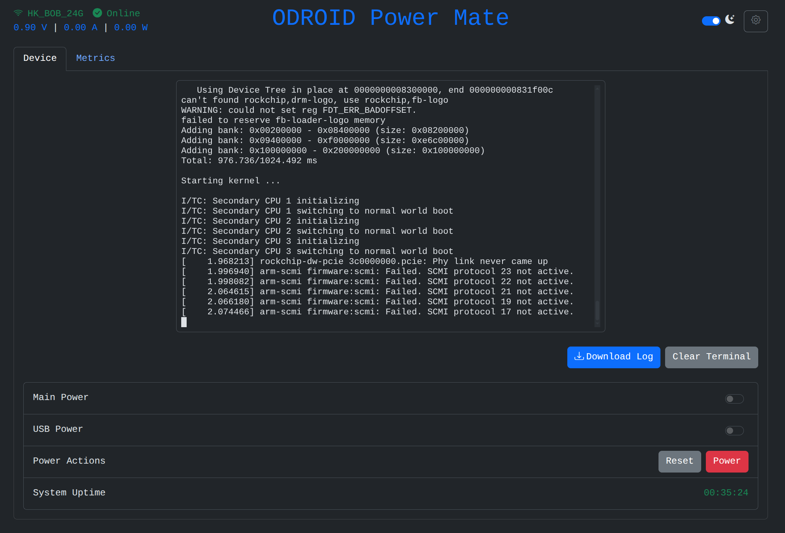
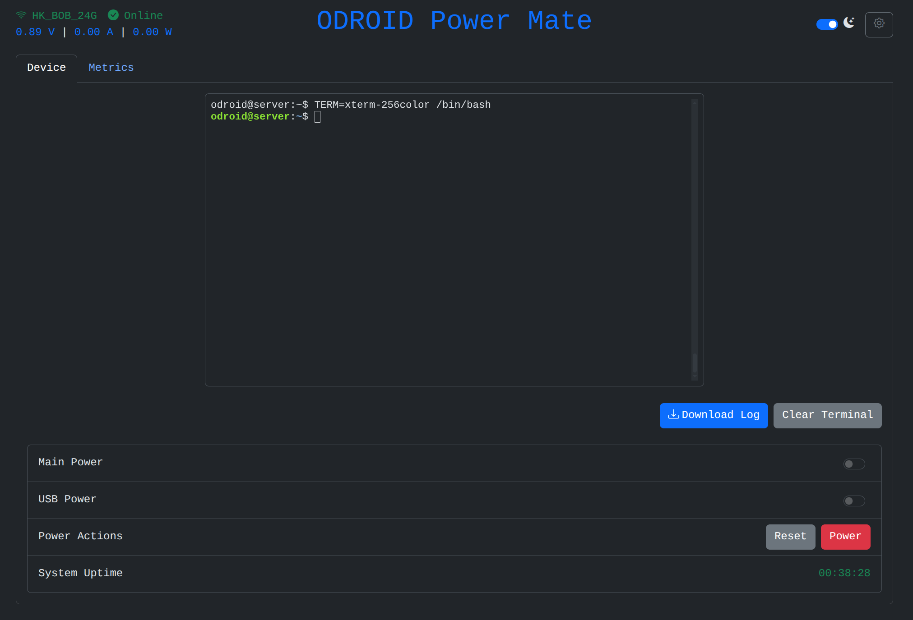
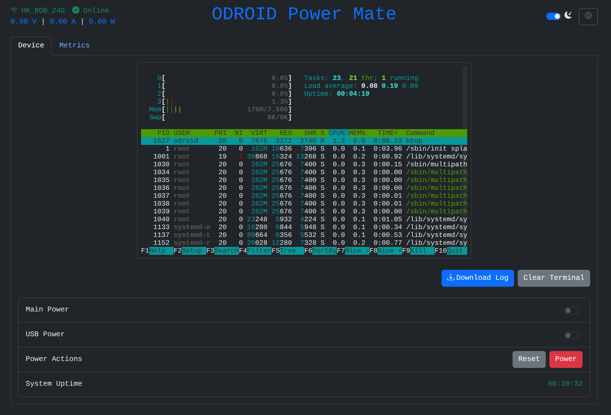

# UART Terminal

> **Warning**
> Data drop may occur depending on the communication quality.



You can see the UART terminal in the Device tab.

You can specify the baud rate in `Setting > Device`, and the supported baud rates are 9600-1500000.


## ANSI Color

Supports the color table of the terminal.

```bash
odroid@server:~$ TERM=xterm-256color /bin/bash
```



