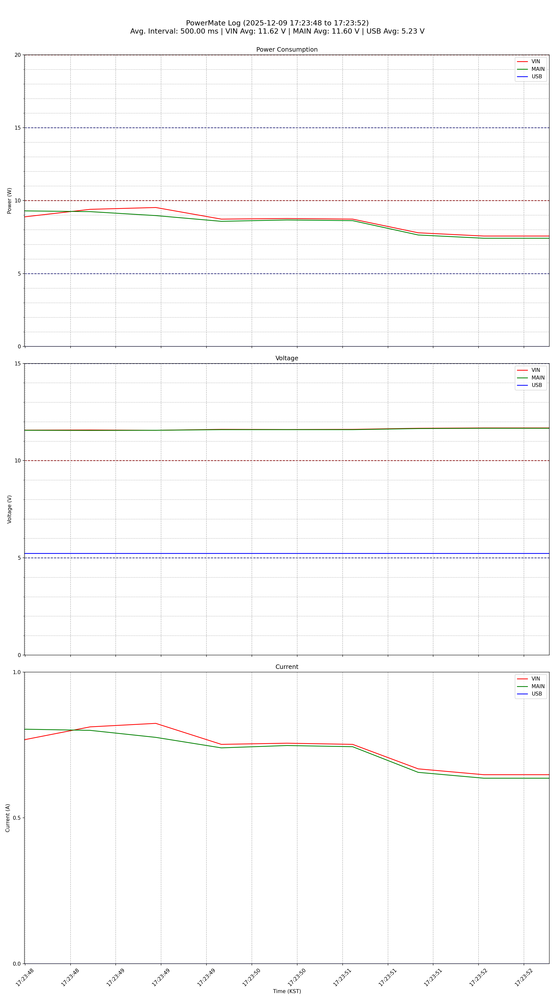

# Odroid PowerMate Logger and Plotter

This directory contains two Python scripts to log power data from an Odroid PowerMate device and visualize it.

1.  `logger.py`: Connects to the device's web server, authenticates, and logs real-time power data from its WebSocket to a CSV file.
2.  `csv_2_plot.py`: Reads the generated CSV file and creates a plot image of the power, voltage, and current data over time.

## Prerequisites

### 1. Clone this example
```bash
git clone https://github.com/hardkernel/odroid-powermate.git
cd odroid-powermate/example/logger
```

### 2. Python and Virtual Environment

It is highly recommended to use a Python virtual environment to manage project dependencies and avoid conflicts with other projects.

Ensure you have Python 3 installed.

1.  **Create a virtual environment:**
    Open your terminal in this directory and run:
    ```bash
    python3 -m venv venv
    ```
    This will create a `venv` directory containing the Python interpreter and libraries.

2.  **Activate the virtual environment:**
    *   **On Windows:**
        ```powershell
        .\venv\Scripts\activate
        ```
    *   **On macOS and Linux:**
        ```bash
        source venv/bin/activate
        ```
    Your terminal prompt should now show `(venv)` at the beginning, indicating that the virtual environment is active.

### 3. Install Required Libraries

With the virtual environment activated, install the necessary Python packages:

```bash
pip3 install requests websockets protobuf pandas matplotlib python-dateutil
```

### 4. Protobuf Generated File

The `logger.py` script uses Google Protocol Buffers (Protobuf) to decode real-time data from the WebSocket. This requires a Python file, `status_pb2.py`, which is generated from a Protobuf definition file (`status.proto`).

**How to Generate `status_pb2.py`:**

1.  **Install Protobuf Compiler Tools:**
    You need the `grpcio-tools` package, which includes the `protoc` compiler and Python plugins. You can install it via pip:
    ```bash
    pip3 install grpcio-tools
    ```

2.  **Locate the `.proto` file:**
    Ensure you have the `status.proto` file in the current directory. This file defines the structure of the data messages.

3.  **Run the Compiler:**
    Execute the following command in your terminal. This command tells `protoc` to look for `status.proto` in the directory (`-I../../proto`) and generate the Python output file (`--python_out=.`) in the same place.
    ```bash
    python3 -m grpc_tools.protoc -I../../proto --python_out=. status.proto
    ```
After running this command, the `status_pb2.py` file will be created, and `logger.py` will be able to use it.

## Usage

The process is a two-step workflow: first log the data, then plot it.

### Step 1: Log Power Data with `logger.py`

Run `logger.py` to connect to your Odroid Smart Power device and save the data to a CSV file.

**Syntax:**
```bash
python3 logger.py <host> -u <username> -p <password> -o <output_file.csv>
```

**Arguments:**
*   `host`: The IP address or hostname of the Odroid Smart Power device (e.g., `192.168.1.50`).
*   `-u`, `--username`: The username for logging in.
*   `-p`, `--password`: The password for logging in.
*   `-o`, `--output`: The path to save the output CSV file. This is required if you want to generate a plot.

**Example:**

This command will log in and save the power data to `power_log.csv`.

```bash
python3 logger.py 192.168.1.50 -u admin -p mypassword -o power_log.csv
```

The script will continue to log data until you stop it with `Ctrl+C`.

### Step 2: Generate a Plot with `csv_2_plot.py`

Once you have a CSV log file, you can use `csv_2_plot.py` to create a visual graph.
You can also use the csv file recorded from PowerMate Web.

**Syntax:**
```bash
python3 csv_2_plot.py <input.csv> <output.png> [options]
```

**Arguments:**
*   `input_csv`: The path to the CSV file generated by `logger.py`.
*   `output_image`: The path to save the output plot image (e.g., `plot.png`).

**Optional Arguments:**
*   `-t`, `--type`: Specify which plots to generate. Choices are `power`, `voltage`, `current`. Default is all three.
*   `-s`, `--source`: Specify which power sources to include. Choices are `vin`, `main`, `usb`. Default is all three.

**Example 1: Default Plot**

This command reads `power_log.csv` and generates a plot containing power, voltage, and current for all sources, saving it as `power_graph.png`.

```bash
python3 csv_2_plot.py power_log.csv power_graph.png
```

**Example 2: Custom Plot**

This command generates a plot showing only the **power** and **current** for the **MAIN** and **USB** sources.

```bash
# main, usb power consumption
python csv_2_plot.py power_log.csv custom_plot.png --type power --source main usb
```

## Example Output

Running the plot script will generate an image file similar to this:



The 5-unit scale is highlighted with a blue dotted line, and the 10-unit scale is highlighted with a red dotted line.