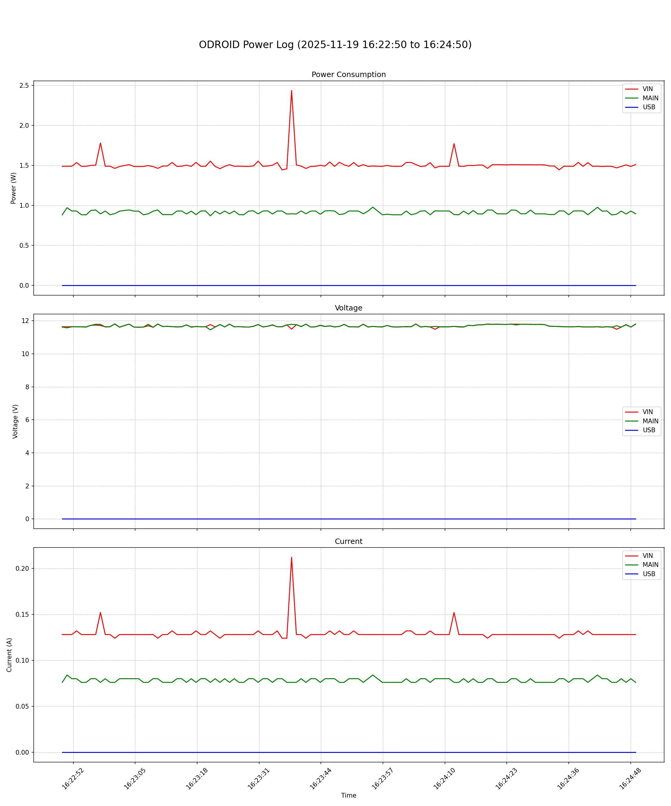

# Power Consumption Logger Example

Based on this script, you can monitor power consumption and implement graph plotting.

## How to Run the Script

### Install Python Virtual Environment

```shell
sudo apt install virtualenv
virtualenv venv
source venv/bin/activate
```

### Install require package

```shell
pip install grpcio-tools requests websockets protobuf pandas matplotlib
```

### Build `status_pb2.py`

```shell
python -m grpc_tools.protoc -I ../../proto --python_out=. status.proto
```

### Execute script

#### Power consumption collection
```shell
# python3 logger.py -u <username> -o <name.csv> -p <password> <address>
python3 logger.py -u admin -p password -o test.csv 192.168.30.5 
```

#### Plot data

```shell
python3 csv_2_plot.py test.csv plot.png
```

